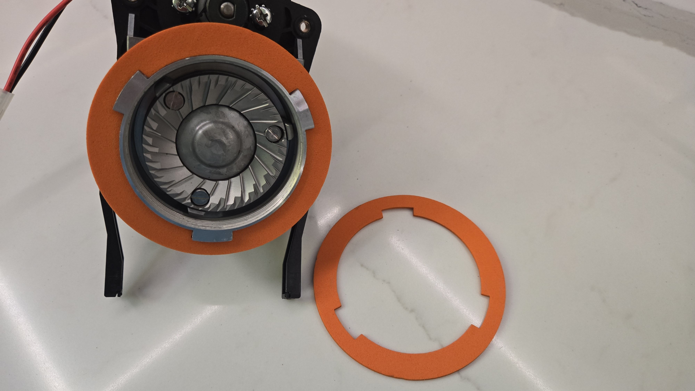
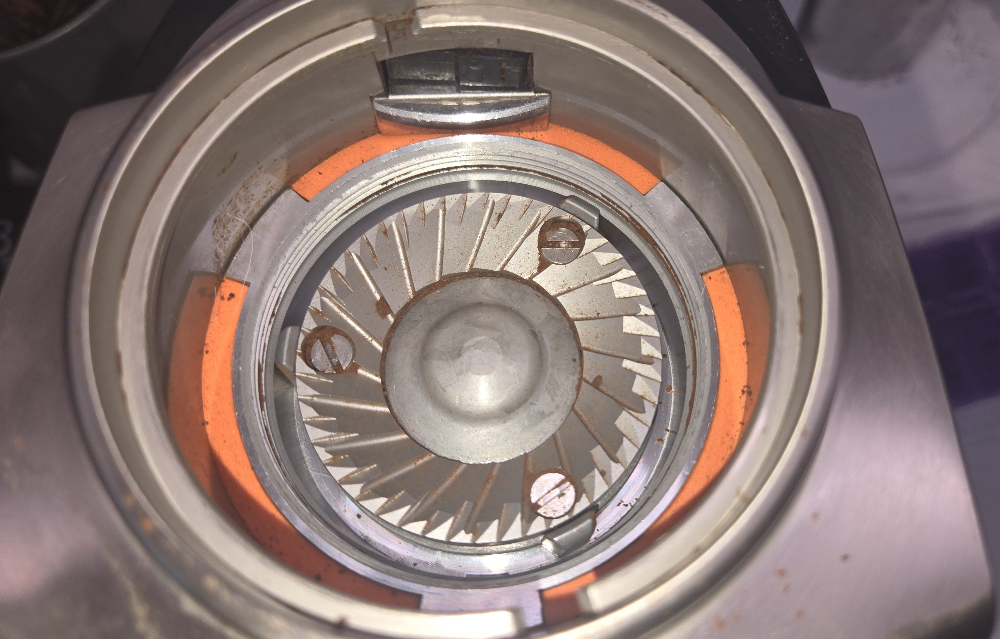
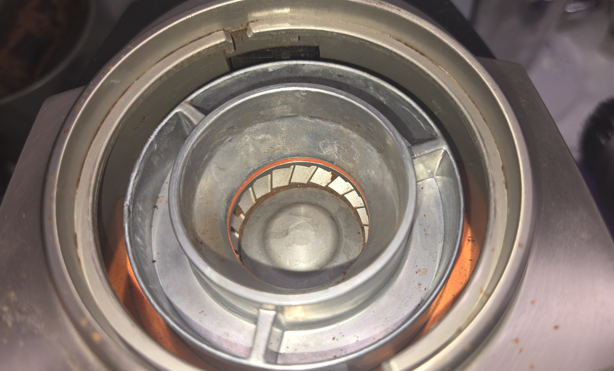

Baratza VarioForte Flat Steel Burr accessories
==============================================

A couple of useful accessories for the Baratza VarioForte adaption.

* Baratza-Flat-Steel-Burr-Holder-Gasket

This is a pattern to cut out a gasket that goes around the new grind
chamber to help keep coffee grounds out of the main body of the
grinder.

This is for using a laser to cut it out of ~4mm EVA foam
(or 2 pieces of 2mm).

* Baratza-Flat-Steel-Burr-Spacer

This is a 3d-printable spacer to go under the flat steel burs to
keep them from deforming when tigtening the screws.

