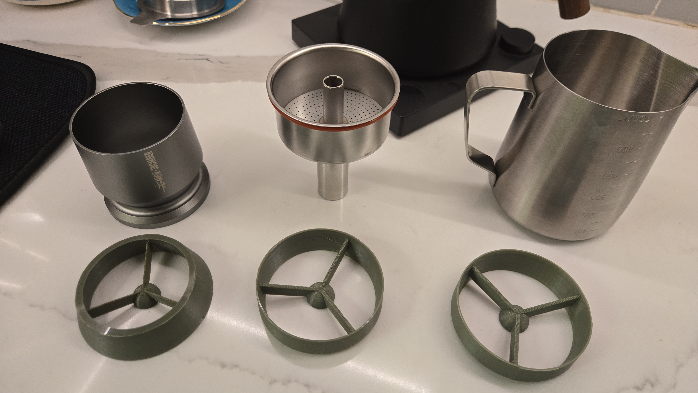
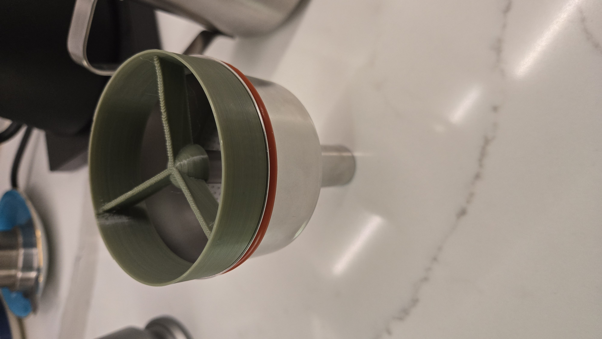
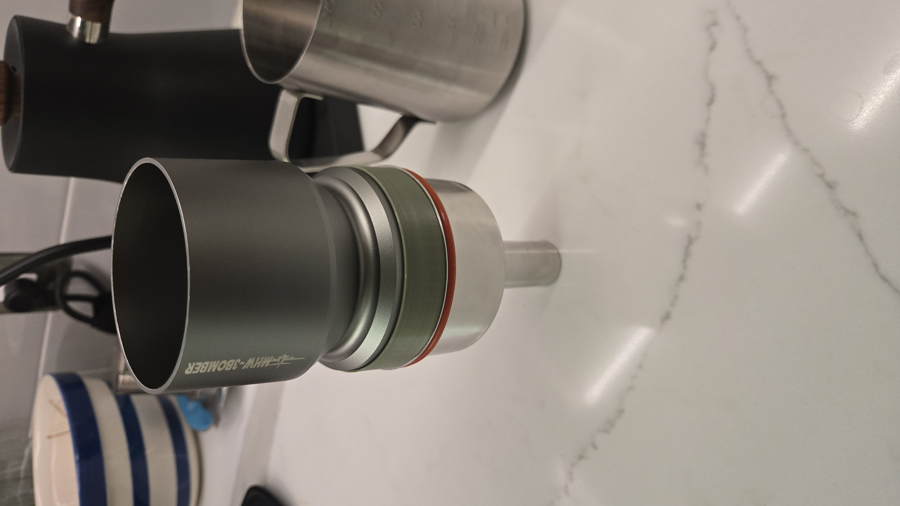
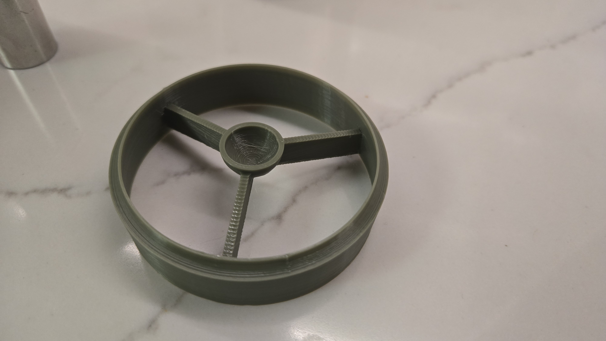
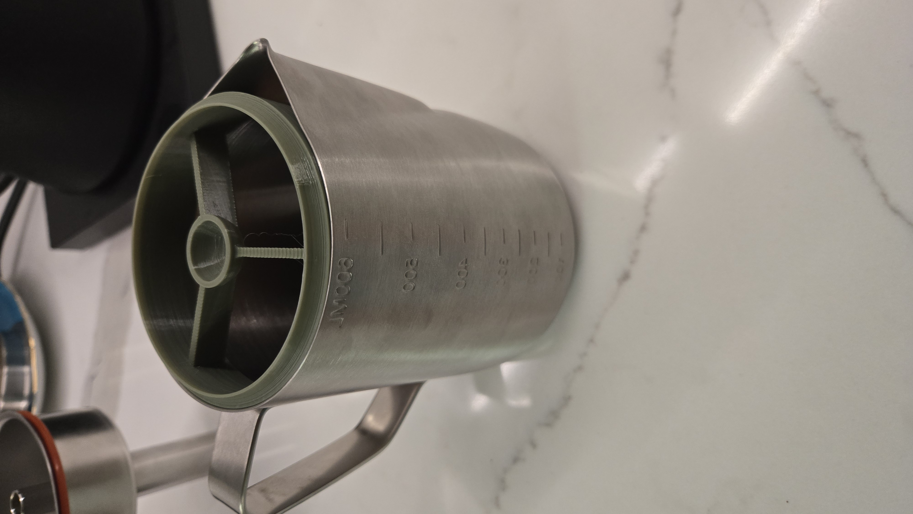

Dosing Funnel for Bellman CX25P
==============================

While the [Bellman CX25P](https://bellmanespresso.com/products/bellman-cx25p-espresso-and-milk-steamer)
is really useful for a latte on the go,
because of the hole in the middle, actually dosing into the
basket is challenging.
This dosing funnel is here to make that easier.

It also adapts it to the MHW-3BOMBER 58mm blind shaker I use
when at home.

