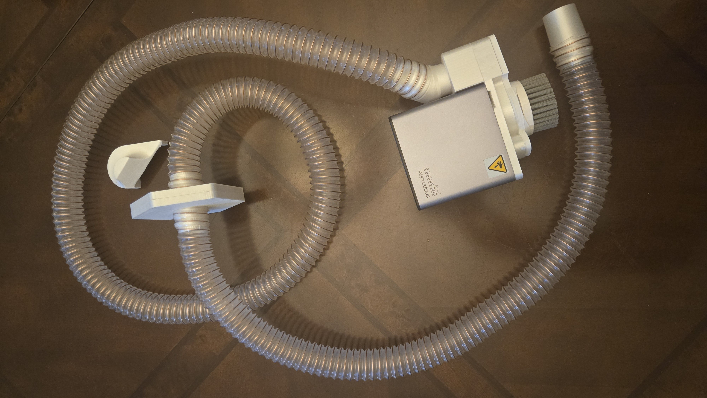
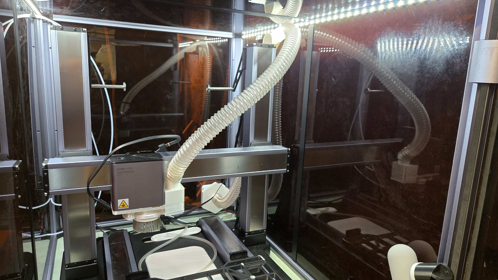
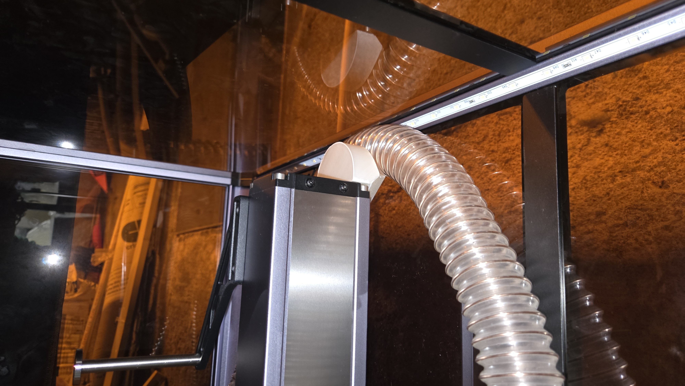

Snapmaker Artisan -- Fan Hole Quick Connect
===========================================

A set of quick connect models to make it easier to change out what is
going through the fan hole on the Snapmaker Artisan.

* Snapmaker-Artisan-Fan-hole-quick-connect.scad

This is the base quick connect, it is a hex magnet plate with a hole the size
of the fan hole.

* Snapmaker-Artisan-Vacuum-Hose-Screw.scad

This uses `Spiral_Extrude.scad` to allow attaching a semi-standard
32mm vacuum hose through the enclosure to be used with the CNC shoe:

Other parts for the vacuum to run the hose from the back to where it
can attach to the CNC head or sit in a holder while using other tools.

    * https://www.thingiverse.com/thing:6037424
    * https://www.thingiverse.com/thing:6776709
    * snapmaker_CNC_vacuum_to_pipe_adaptor.scad
    * vacuum_extension.scad
    * vacuum_hose_guide.scad
    * vacuum_hose_holder.scad

