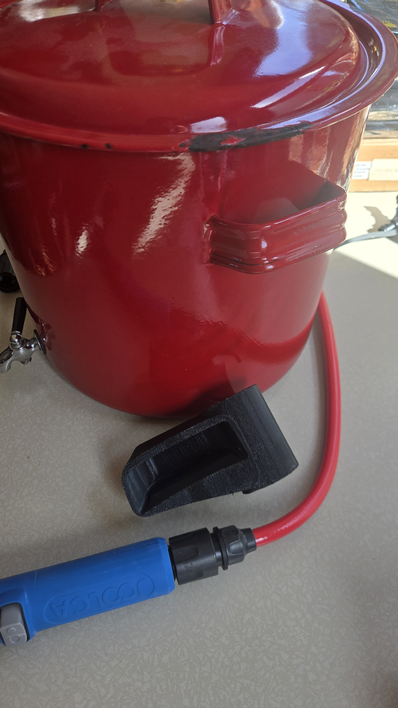
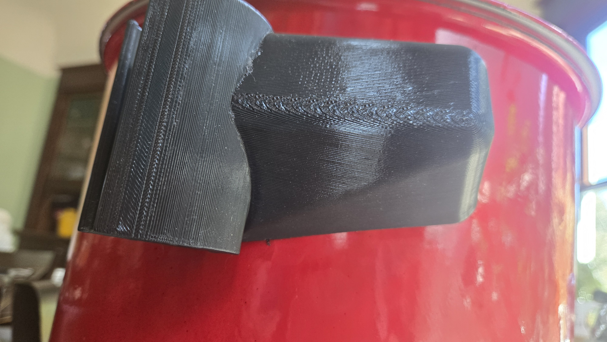
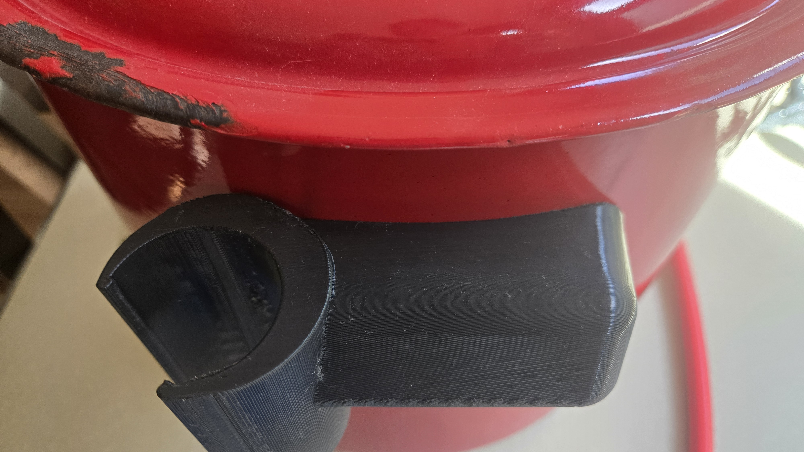
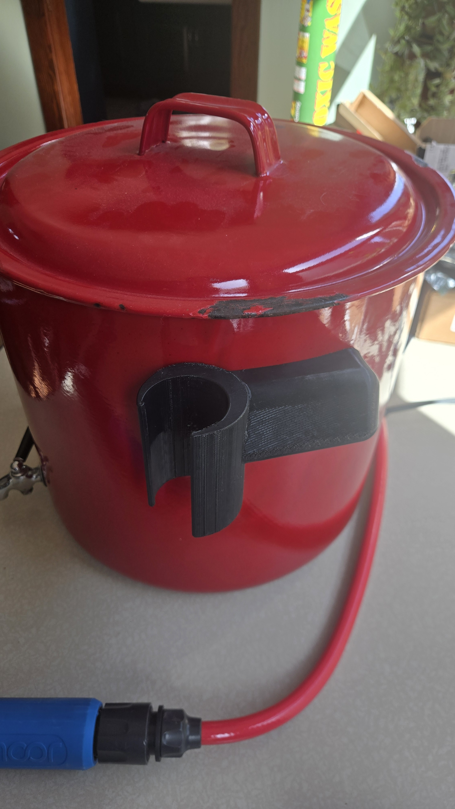
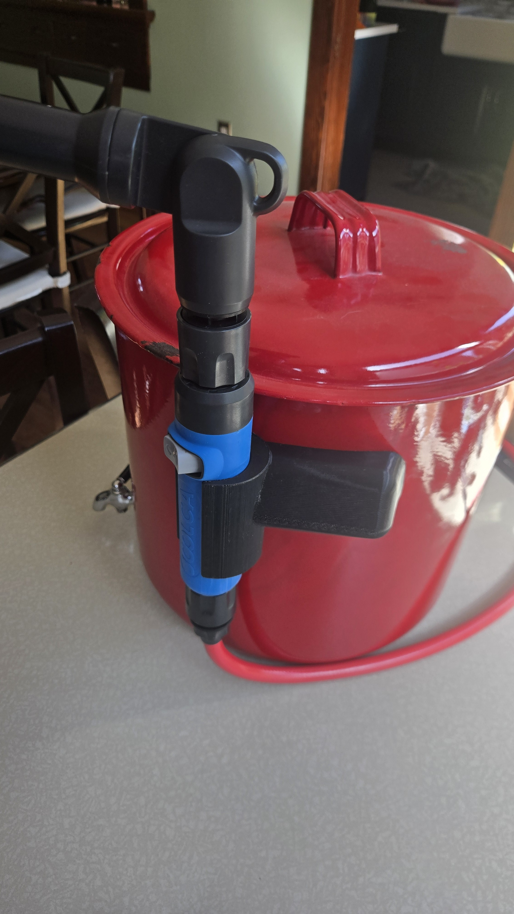
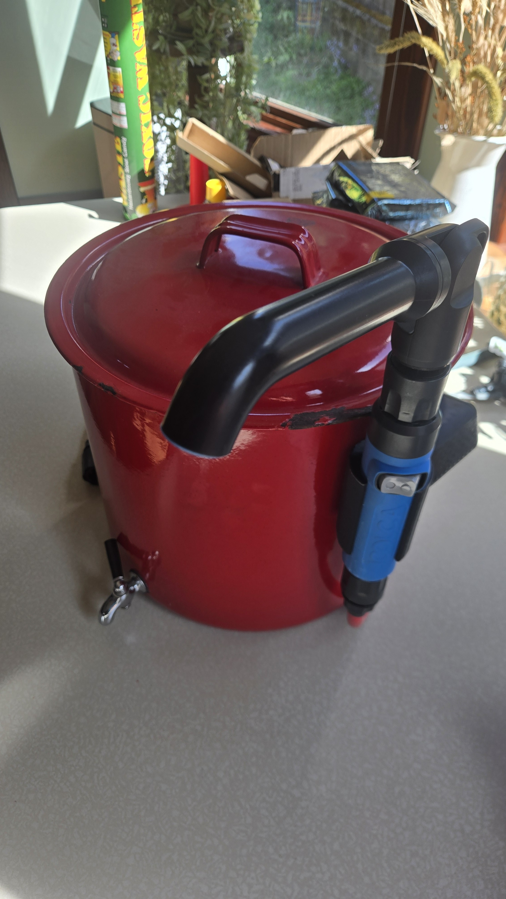

Joolca Shower Handle Bracket for our Enamel Coated Water Jug
============================================================

We have used this red water jug for hand-washing and rinse water at our off-grid property.
We recently got a Joolca HotTap that makes things more civilized,
but we still use the jug for some things because it uses less power and isn't as noisy.
This lets us mount a [shower head handle](https://www.joolca.com/products/shower-head-handle)
to the side of it to use when we need more water flow.
The normal magnetic bracket was not good enough on the thin metal of the jug.

I printed it out of some FlashForge flexible PLA I had on hand so it would
flex over the handle and I wouldn't have to design a way to lock it in place.

* 
* 
* 
* 
* 
* 
