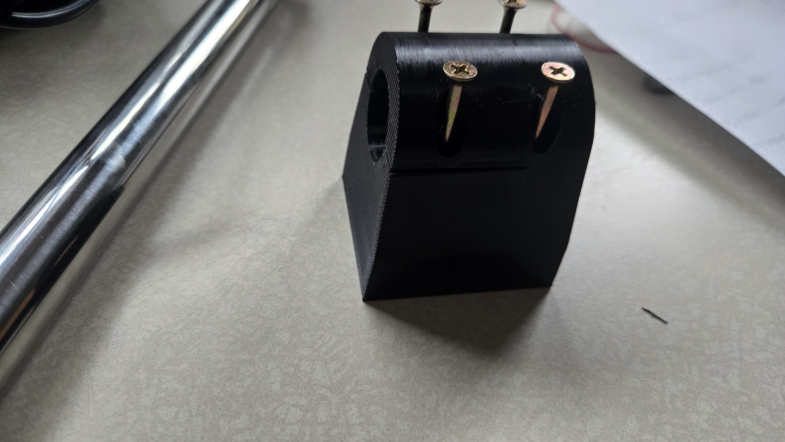
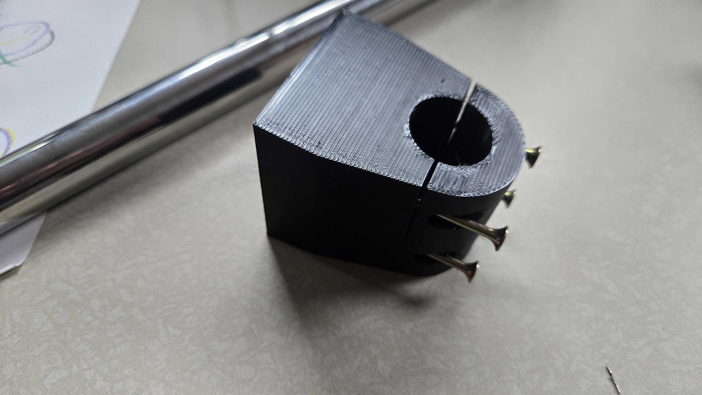
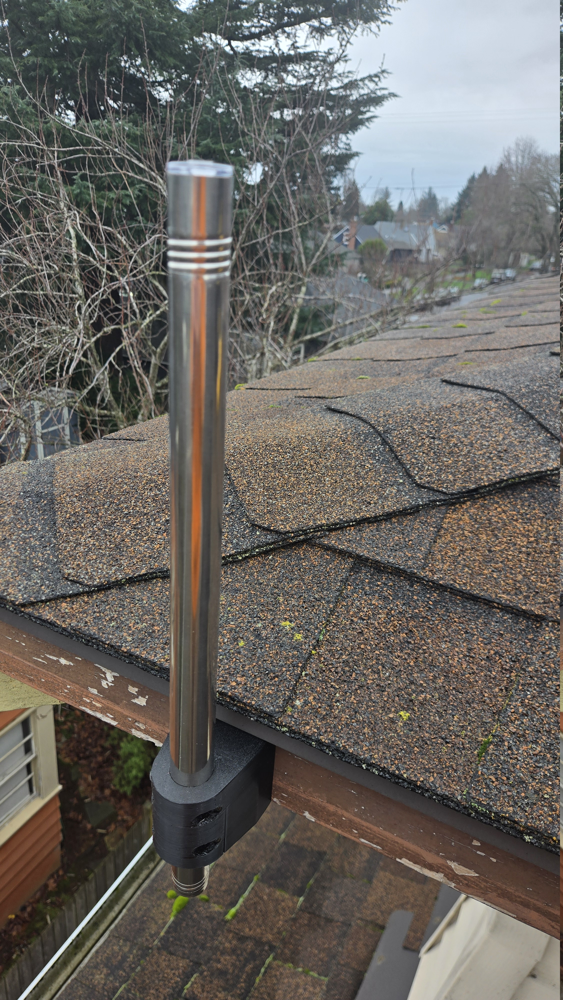
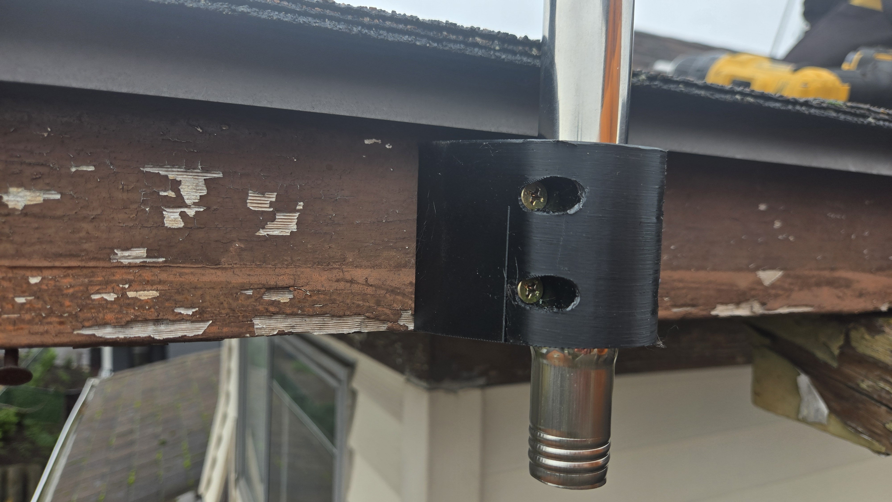
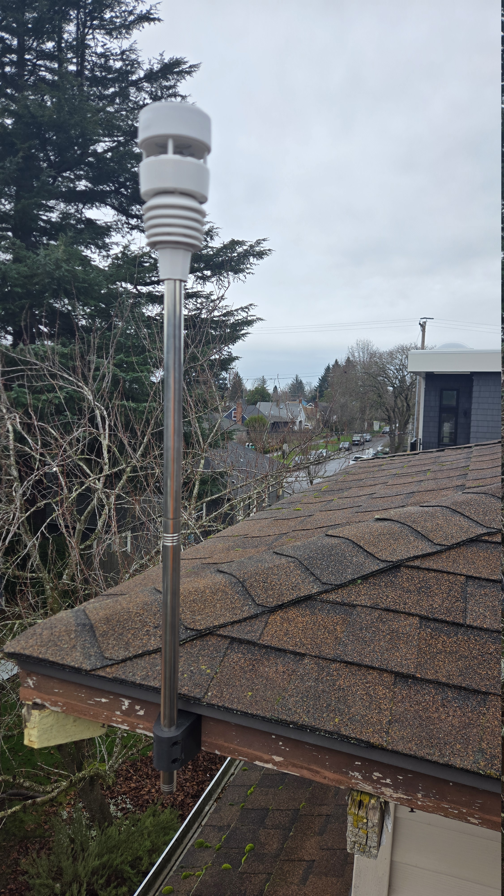

We got an Ecowitt WS90 "Wittboy" weatherstation to use with Home
Assistant and needed to mount it outside.
I _could_ have gone and gotten something from the store, but I have
a 3d printer and some screw together pipes.
So, drew something up real quick and mounted it to the eve of the
soffit.

