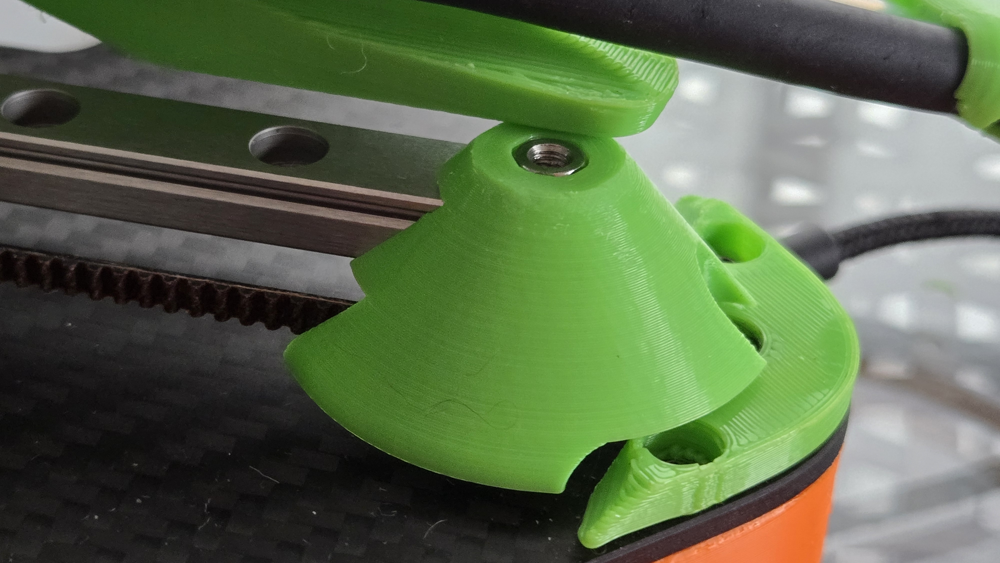
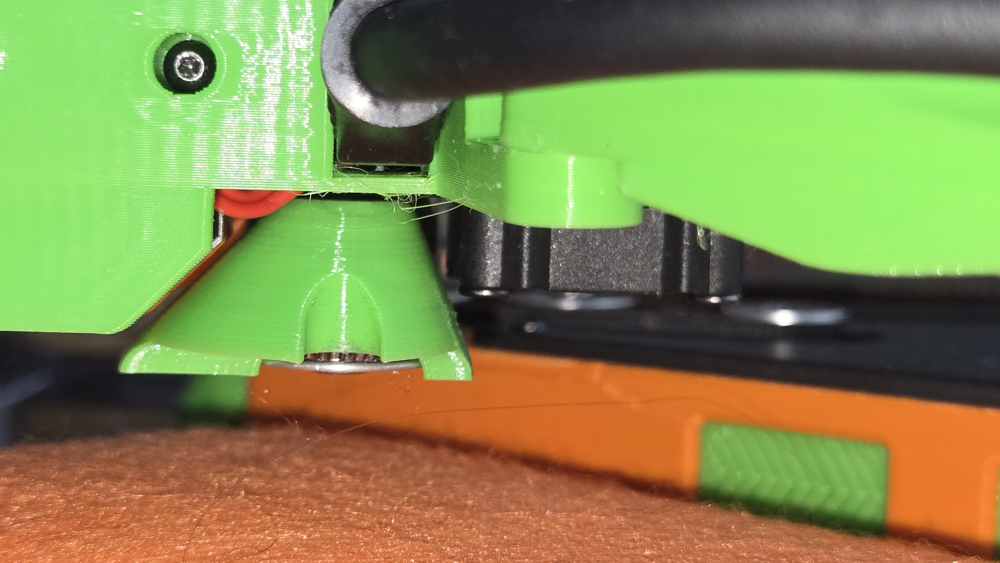
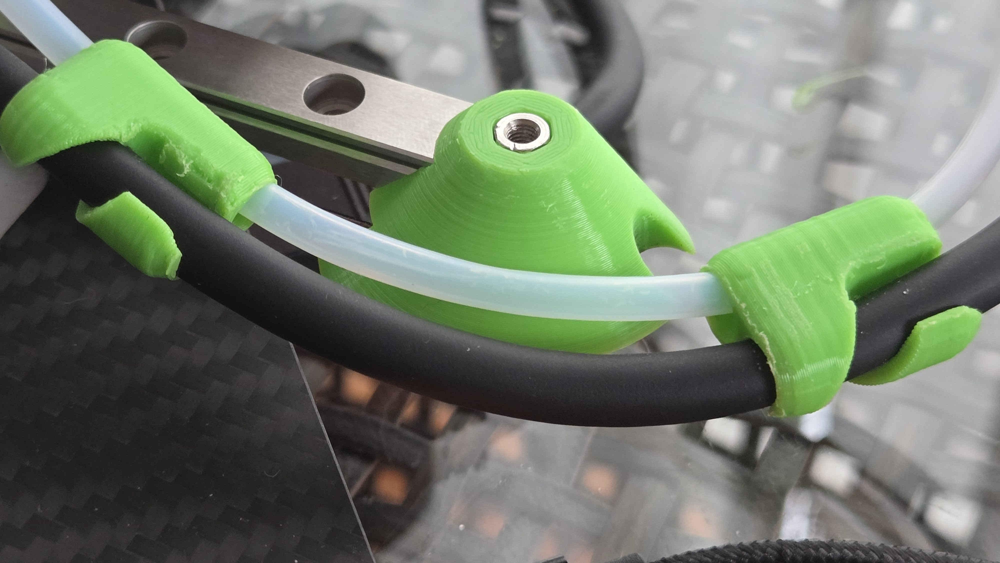
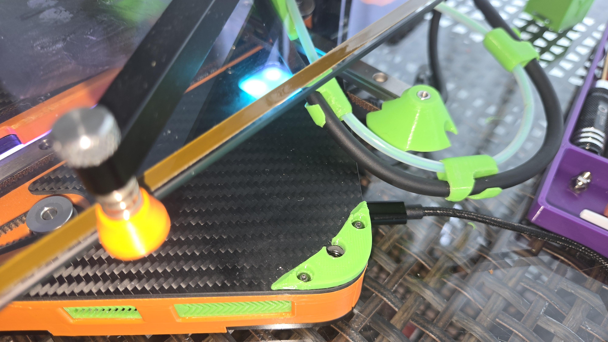

Positron3d Cable Managment Clips
================================

Some cable clips and such to keep the printhead cable and bowden
tube on the Positron 3D printer in the right position.

https://www.positron3d.com/

You will want at least three clips and a stand.

There is also a cable guide for the end of the linear rail

